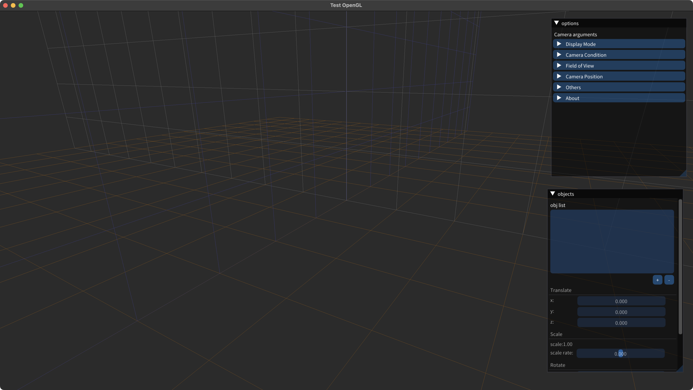

# 基于OpenGL的obj格式3D模型预览软件

本项目源自数字媒体技术专业计算机图形学课程的课程设计：基于OpenGL的obj文件显示程序，并在课程设计的基础上添加了以下功能：

 - 基于imgui的图形界面
 - 从本地导入obj模型并显示（目前仅完成了macOS的该功能，Windows的本地导入正在开发中）
 - 使用滚动条的相机视角的变换
 - obj文件导入后的移动、旋转、缩放等变换操作（正在开发中）

---

## 1. 功能展示

 - 基础功能：obj文件的显示

 

 - 图形界面展示

 

 - 本地obj文件导入

 

 - 相机视角旋转与移动

 

 - 导入多个obj文件并展示

 

 - obj模型的移动、缩放、旋转变换

 

---
## 2. 原理说明

### 1. Phong光照模型

本项目中的obj文件展示功能的实现基于Phong光照模型，该模型为计算机图形学课程中教授的一种较为真实的光照模式，该模式把3d模型受到的光照分为环境泛光、漫反射和镜面高光3个部分。

**环境泛光**为模型在场景中受到其他物体的反射光线，无论是否受到光源的光照，环境泛光始终存在，在Phong模型中环境泛光为一个固定值；**漫反射**为粗糙物体对于光线向四面八方的反射，漫反射与观察者的方位视角无关，仅与光源的位置、光线的方向有关；**镜面高光**为较为光滑物体表面的高光，镜面高光与光源位置和观察位置有关。

Phong光照模型在片元着色器中实现。下面通过片元着色器GLSL代码对本项目中Phong模型的实现进行说明：

#### 1) 环境泛光

在本项目中环境泛光由环境光颜色与泛光强度决定，在片元着色器中环境泛光的实现如下（本项目中环境光颜色的RGB值为 *\#080808*）：
```
uniform float ambientStrength;
...
vec3 ambient = vec3(.5f, .5f, .5f) * ambientStrength;
```
#### 2) 漫反射

漫反射由入射光线与法线的夹角、光照与物体的颜色有关。在本项目中将物体的颜色默认为 *\#ffffff* ，入射光线与法向量的夹角的余弦值由光线方向与法线向量（均为单位向量）的点乘表示。在片元着色器中漫反射的实现如下：

```
uniform vec3 lightPos;
...
vec3 diffuse = max(dot((vtxpos - lightPos), vtxnorm), .0f) * vec3(1.0f, 1.0f, 1.0f);
```

#### 3) 镜面高光

