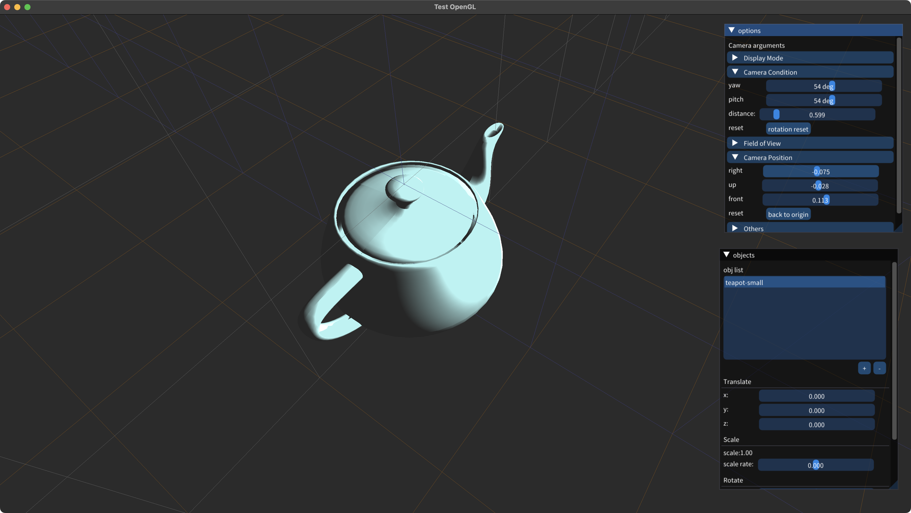

# 基于OpenGL的obj格式3D模型预览软件

本项目源自数字媒体技术专业计算机图形学课程的课程设计：基于OpenGL的obj文件显示程序，并在课程设计的基础上添加了以下功能：

 - 基于imgui的图形界面
 - 从本地导入obj模型并显示（目前仅完成了macOS的该功能，Windows的本地导入正在开发中）
 - 使用滚动条的相机视角的变换
 - obj文件导入后的移动、旋转、缩放等变换操作（正在开发中）

---

## 1. 功能展示

 - 基础功能：obj文件的显示

 

 - 图形界面展示

 

 - 本地obj文件导入

 

 - 相机视角旋转与移动

 

 - 导入多个obj文件并展示

 

 - obj模型的移动、缩放、旋转变换

 

---
## 2. 原理说明

### 1. Phong光照模型

本项目中的obj文件展示功能的实现基于Phong光照模型，该模型为计算机图形学课程中教授的一种较为真实的光照模式，该模式把3d模型受到的光照分为环境泛光、漫反射和镜面高光3个部分。

**环境泛光**为模型在场景中受到其他物体的反射光线，无论是否受到光源的光照，环境泛光始终存在，在Phong模型中环境泛光为一个固定值；**漫反射**为粗糙物体对于光线向四面八方的反射，漫反射与观察者的方位视角无关，仅与光源的位置、光线的方向有关；**镜面高光**为较为光滑物体表面的高光，镜面高光与光源位置和观察位置有关。

Phong光照模型在片元着色器中实现。下面通过片元着色器GLSL代码对本项目中Phong模型的实现进行说明：

#### 1) 环境泛光

在本项目中环境泛光由环境光颜色与泛光强度决定，在片元着色器中环境泛光的实现如下（本项目中环境光颜色的RGB值为 *\#080808*）：
```
uniform float ambientStrength;
...
vec3 ambient = vec3(.5f, .5f, .5f) * ambientStrength;
```
#### 2) 漫反射

漫反射由入射光线与法线的夹角、光照与物体的颜色有关。在本项目中将物体的颜色默认为 *\#ffffff* ，入射光线与法向量的夹角的余弦值由光线方向与法线向量（均为单位向量）的点乘表示。在片元着色器中漫反射的实现如下：

```
uniform vec3 lightPos;
...
vec3 diffuse = max(dot((vtxpos - lightPos), vtxnorm), .0f) * vec3(1.0f, 1.0f, 1.0f);
```

#### 3) 镜面高光

镜面高光由反射光方向、观察者位置有关，当观察者正对反射光时高光最强，并且高光随着观察者偏离反射光而减弱；同时镜面高光也与材质的高光系数有关，高光系数代表高光在材质上的衰减程度，高光系数月大高光面积越小。镜面高光在片元着色器中的实现如下;

```
uniform vec3 lightPos;
uniform vec3 viewPos;
uniform float shininess;
...
float delta = dot(normalize(viewPos - vtxpos), reflect((vtxpos - lightPos), vtxnorm));
if(delta > 0){
    vec3 specular = vec3(min(pow(delta, shininess), 1.0f));
}
```

将环境泛光、漫反射与镜面高光组合得到完整的Phong光照模型，在片元着色器中实现如下:

```
#version 330 core

in vec3 vtxpos;
in vec3 vtxnorm;

uniform float ambientStrength;
uniform vec3 lightColor;
uniform vec3 lightPos;
uniform vec3 viewPos;
uniform float shininess;

out vec4 FragColor;

void main(){
    vec3 ambient = vec3(.5f, .5f, .5f) * ambientStrength;
    vec3 diffuse = max(dot((vtxpos - lightPos), vtxnorm), .0f) * vec3(1.0f, 1.0f, 1.0f);
    float delta = dot(normalize(viewPos - vtxpos), reflect((vtxpos - lightPos), vtxnorm));
    if(delta > 0){
        vec3 specular = vec3(min(pow(delta, shininess), 1.0f));
        FragColor =  vec4(ambient + min((diffuse + specular), vec3(1, 1, 1)) * lightColor, 1.0f);
    }
    else{
        FragColor = vec4(ambient + diffuse * lightColor, 1.0f);
    }
}
```

### 2. 相机类及其变换的实现

本项目中相机类的设计与实现参考了教程[learn-opengl中的Camera教程](https://learnopengl.com/Getting-started/Camera)相机类[源代码](https://learnopengl.com/code_viewer_gh.php?code=includes/learnopengl/camera.h)，并根据本项目的实际情况进行了修改。本项目中相机类Camera的定义与实现位于文件camera2.hpp与camera2.cpp中。

相机类包含基本参数相机位置`Position`，相机朝向`Front`，相机上方向`Up`，右方向`Right`；以及用于调整上述参数的其他参数，如用于决定相机朝向的欧拉角参数偏航角`Yaw`和俯仰角`Pitch`，和用于移动相机位置的参数`transFront`，`transUp`以及`transRight`，分别用于表示相机位置向当前朝向(当前正交基下)的前(z轴负方向)、上(y轴正方向)和右(x轴正方向)方向移动的距离。由于相机部分参数形式为指针，以便在imgui图形界面中进行调整。

当相机各参数变化时，调用更新相机状态函数，以保证相机状态改变与相机参数变化同步。该函数根据当前相机的欧拉角参数求得当前相机坐标系的标准正交基，并将相机位置根据位置参数移动至相应位置，以求得正确的观察矩阵。该函数的实现如下：

```
void Camera::updateCameraVectors(void){
    glm::vec3 front;
    front.x = cos(*Yaw - .5f * M_PI) * cos(-*Pitch);
    front.y = sin(-*Pitch);
    front.z = sin(*Yaw - .5f * M_PI) * cos(-*Pitch);
    Front   = glm::normalize(front);
    
    if(abs(*Pitch) < .5f * M_PI || abs(*Pitch) > 1.5f * M_PI)
        Right = glm::normalize(glm::cross(Front, WorldUp));
    else
        Right = glm::normalize(glm::cross(WorldUp, Front));
    Up  = glm::normalize(glm::cross(Right, Front));
    
    Position = -*Distance * (Front + glm::mat3(Right, Up, Front) * glm::vec3(*(this->transRight), *(this->transUp), -*(this->transFront)));
}
```

相机类的各向量参数通过glm库定义，并且根据相机的各参数，通过glm库的`lookAt`函数构造观察矩阵，并传入顶点着色器中，实现相机视角变换。观察矩阵实现如下：

```
glm::mat4 Camera::GetViewMatrix(void){
    return glm::lookAt(Position, Position + Front, Up);
}
```

### 3. obj文件的读取以及顶点法向量的计算

#### 1) obj文件的读取

obj文件的读取由cpp的文件流fstream实现，程序将选定的obj文件以行读取，并根据obj文件格式对读取的行内容进行分析，存储于相应的数组中。项目中定义了数组`data_v`, `data_f`, `data_vn`以存储读取的顶点坐标、面和计算所得的顶点法向量数据。

以本项目示例所展示的bunny_small.obj文件为例说明obj文件的格式。obj文件以 \# 开头的内容为注释，故当读取到 \# 符号时，直接读取下一行内容；

```
# OBJ file format with ext .obj
# vertex count = 2503
# face count = 4968
```

以 `v` 开头的内容为顶点坐标，通常在v后有三个数据，代表该顶点的x, y, z轴坐标数据，当读取到v后继续读取其后的三个浮点型数据，并存储于顶点数组 `data_v` 中；

```
v -3.4101800e-003 1.3031957e-001 2.1754370e-002
v -8.1719160e-002 1.5250145e-001 2.9656090e-002
v -3.0543480e-002 1.2477885e-001 1.0983400e-003
```

以`f` 开头的数据为面的数据，该类数据有3个值，分别对应组成该面的3个顶点，而每个表示顶点的数据通常又包含3个 / 分隔的数据，分别对应该顶点坐标的下标、该顶点贴图坐标的下标、该顶点法向量的下标，本项目仅读取面的顶点坐标的下标数据，并存储至数组 `data_f` 中 *(由于obj文件的顶点坐标下标以1开头，故读取时对所有下标进行-1处理)* ；

```
f 320/320/297 321/321/298 323/323/300
f 323/323/300 316/316/293 320/320/297
f 321/321/298 324/324/301 323/323/300
```

以 `vt`开 头的数据为贴图坐标，该坐标仅有两个值，分别表示该点对应贴图坐标的x与y坐标；以 `vn` 开头的数据为法向量值，该数据有三个值，代表了该法向量的xyz坐标值，以上两个数据在本项目中不进行读取。

#### 2) 顶点法向量的计算

顶点法向量为计算Phong光照模型时的必要数据，顶点法向量数据的偏差会导致Phong光照模型中的漫反射、镜面高光计算出错，从而导致渲染出的3d模型不符合常规，如出现部分面片光照消失等情况。

本项目中对读取每一个面ABC，将其的 **AC** 与 **AB** 向量进行叉乘，以得到面ABC的法向量；将每一个点参与构成的所有面的法向量求和并归一化，以求得obj模型每一个点的顶点法向量数据，并存储于数组 `data_vn` 中。由于obj文件中构成一个面的3个顶点的位置是按照一定规律排布的，故计算面的顶点法向量时，将该面顶点下标数据的第一、三个数据对应的顶点坐标相减得到 **AC** ，将第一、二个数据对应的顶点坐标数据相减得到 **AB** ，进行叉乘后累加至该面3个顶点在顶点法向量数组 `data_vn` 中对应的值；当所有顶点法向量均计算完毕后，对所得的每一个顶点法向量进行归一化计算，得到最终的顶点法向量数据。顶点法向量的计算如下：

```
bool Loader::calc_vn(void){
    data_vn = vector<float>(data_v.size(), .0f);

    for(int fid = 0; fid < data_f.size() / 3; fid++){
        glm::vec3 vtx_a = get_coord(data_f[fid * 3]);
        glm::vec3 vtx_b = get_coord(data_f[fid * 3 + 1]);
        glm::vec3 vtx_c = get_coord(data_f[fid * 3 + 2]);

        glm::vec3 _fn = glm::normalize(glm::cross(vtx_c - vtx_a, vtx_b - vtx_a));

        for (int vnvi = 0; vnvi < 3; vnvi++)
            for (int vnci = 0; vnci < 3; vnci++)
                data_vn[3 * data_f[fid * 3 + vnvi] + vnci] += _fn[vnci];
    }

    for (int vid = 0; vid < data_vn.size() / 3; vid++) {
        glm::vec3 vtx_norm = glm::normalize(glm::vec3(data_vn[vid * 3], data_vn[vid * 3 + 1], data_vn[vid * 3 + 2]));
        data_vn[vid * 3] = vtx_norm[0];
        data_vn[vid * 3 + 1] = vtx_norm[1];
        data_vn[vid * 3 + 2] = vtx_norm[2];
    }
    return true;
}
```

### 4. 图形界面的实现

图形界面的实现使用了 [imgui](https://github.com/ocornut/imgui) 。本项目使用imgui构建了3个面板，分别为相机变换面板、obj面板和文件导入面板。

相机变换面板由类 `ImGuiPanel` 实现，该类实现了通过滚动条调节相机各项参数，以及改变模型的显示模式等其他功能，该面板的设计和实现位于代码imgui_panel.hpp和imgui_panel.cpp中；

obj面板由类 `ObjPanel` 实现，该类实现了obj文件的添加、删除、变换等obj文件管理功能，该面板的设计与实现位于代码obj_panel.hpp与obj_panel.cpp中；

文件导入面板由类 `FileDialog` 实现，该类实现了从本地导入obj文件的文件对话框(由于macOS系统没有适用于cpp的文件对话框接口，故只能自己写一个)，该类位于代码file_dialog.hpp与file_dialog.cpp中。

-----
## 3. 其他

 - 项目使用了开源中文字体[思源黑体](https://github.com/adobe-fonts/source-han-sans)，以保证项目中的中文字符正常显示；
 - 新版XCode太tm丑了，不更新还不让用，差评
